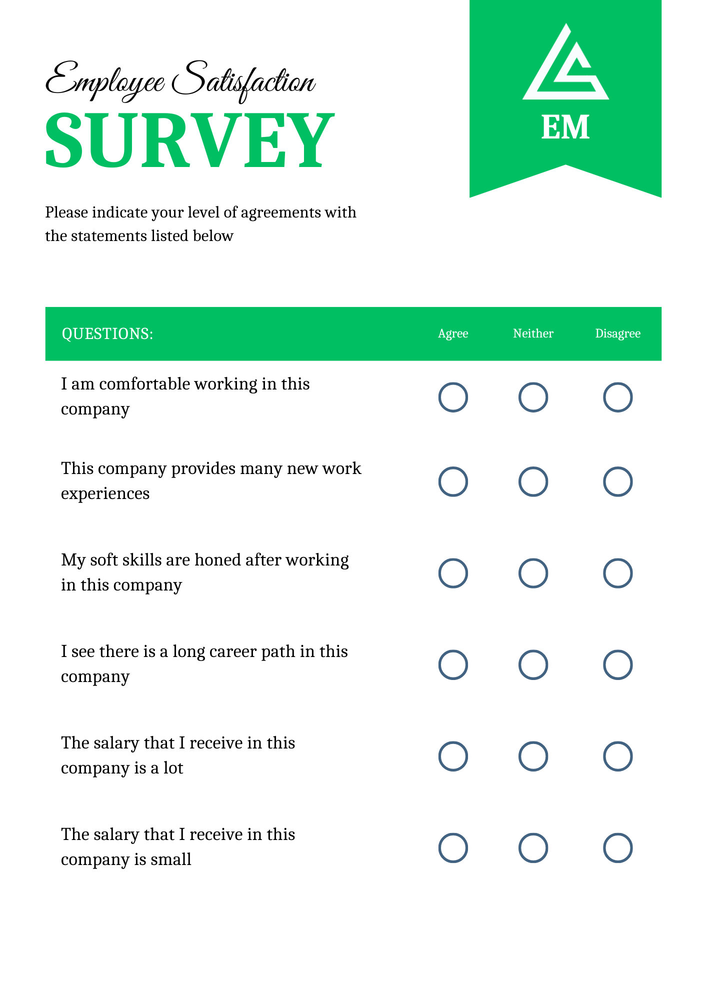
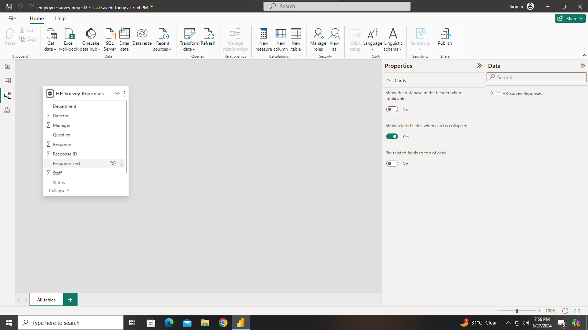
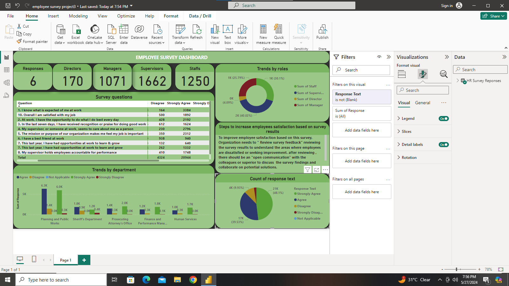
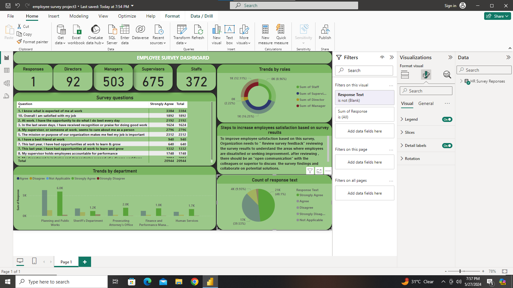
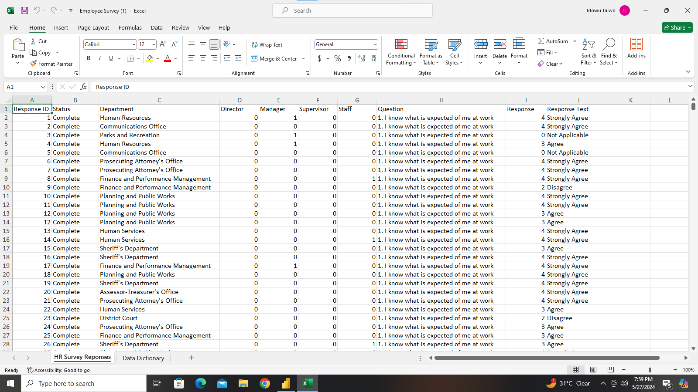

# EMPLOYEE-SURVEY

## introduction

This is a powerbi project on **employee survey**,we delve into the valuable feedback provided by our team members. By examining the survey data, we aim to identify the key insights that can guide us in enhancing employee satisfaction and fostering a more positive work environment. 

## problem statement

1. Which survey questions did respondents agree with or disagree with most?
2. Do you see any patterns or trends by departmebt or role?
3. As an employer, what steps might you take to improve employee satisfaction based on the survey results?

   ## skills

The following powerbi feactures were incoporated:
- Bookingmarking, 
- Dax,
- Quickmeasure,
-  Page
-  navigation,
-  Modelling,
-  Filters,
-  Tooltips,
-  Button

  ## Modelling
  Automatically derived relationship
  

  ## Visualization
  This dataset comprises of two pages
  
  

  ## Customer History

 

  ## Conclusion/Recomendation
  After analyzing the employee survey data, several key conclusion have emerged. it is evident that communication within organisation requires improvement, as highlighted by feedback regarding transparency and clarity in information sharing.
